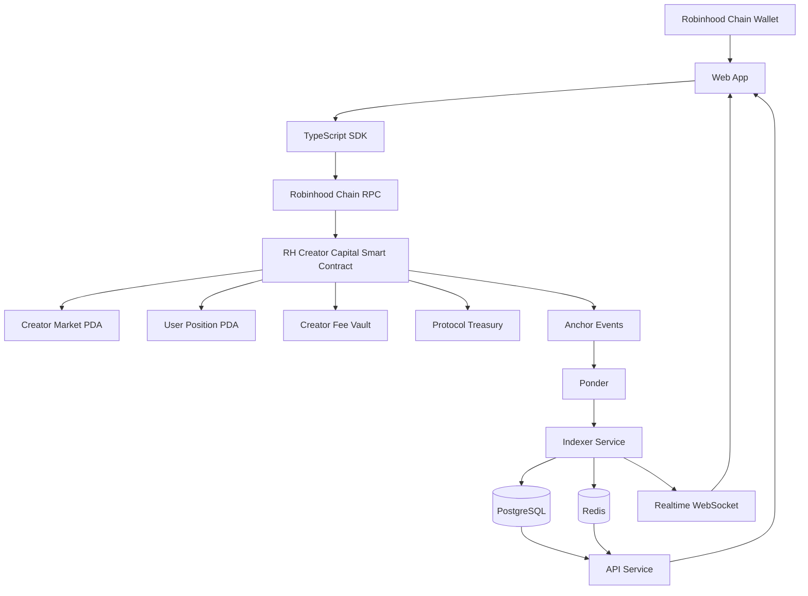

# RH Creator Capital


> **Disclaimer:**  It is not financial advice, does not promote any "pump and dump" schemes, and should not be used to facilitate illegal financial activities or market manipulation.

> A Robinhood Chain-native social capital market where every creator can become an on-chain market.

RH Creator Capital lets users discover creators, buy and sell Creator Keys through a deterministic bonding curve, follow real-time price action, and verify every trade on Robinhood Chain.

The product takes inspiration from social markets such as friend.tech and the fast market experience of modern decentralized exchanges, while using a Robinhood Chain-first architecture built around on-chain pricing, creator fees, real-time indexing, and market charts for every creator.

## Core Idea

Every creator has a dedicated market.

Users can:

- Discover creator markets
- Create a market for a creator
- Buy Creator Keys
- Sell Creator Keys
- Track real-time price action
- View candlestick charts for every creator market
- Monitor market cap, volume, holders, and supply
- Track portfolio positions and PnL
- Verify transactions on Robinhood Chain
- Let creators claim their market through X identity verification
- Route creator fees directly through the protocol

The core rule is simple:

```text
Smart Contract = Source of Truth
Backend        = Indexing + Analytics + API
Frontend       = Interface
```

If indexed data and on-chain state ever disagree, the Robinhood Chain program wins.

---

## Product Experience

```text
Discover Creator
      ↓
Open Creator Market
      ↓
View Live Candlestick Chart
      ↓
Get Buy / Sell Quote
      ↓
Sign EVM Transaction
      ↓
Bonding Curve Executes Trade
      ↓
Creator + Protocol Fees Settle
      ↓
Anchor Event Emitted
      ↓
Indexer Updates Market Data
      ↓
Chart + Activity + Portfolio Update Realtime
```

Every creator market is designed to behave like a real trading market, not a static profile page.

---

## Key Features

### Creator Markets

Each X creator can have a dedicated market identified by their immutable X user ID.

Each market exposes:

- Creator identity
- Creator Key price
- Social Capital
- Circulating supply
- Holder count
- 24H volume
- Total volume
- 24H price change
- Creator earnings
- Trade history
- Top holders
- Real-time chart

### Creator Keys

Creator Keys are the primary market asset.

For the MVP, balances are stored in Smart Contract Derived Accounts instead of issuing a separate ERC20 token for every creator.

This keeps the market engine simple and allows the program to enforce the bonding curve directly.

### Bonding Curve

Price discovery happens on-chain through a deterministic bonding curve.

Initial model:

```text
Price(s) = base + k × s²
```

Where `s` represents current Creator Key supply.

All final pricing is calculated and validated inside the Anchor program.

Frontend and backend quote calculations are advisory only.

### Real-Time Market Charts

Every creator market must include a full real-time trading chart.

This is a core product requirement.

Supported chart functionality:

- Candlestick OHLC
- Real-time candle updates
- Volume
- Crosshair
- Price tooltip
- Time tooltip
- Zoom
- Pan
- Auto-scale
- Current price marker
- 24H high and low
- Timeframe switching

MVP timeframes:

```text
1m
5m
15m
1h
4h
1d
```

Optional later:

```text
Tick / 1s mode
```

Recommended chart engine:

```text
TradingView Lightweight Charts
```

Chart data must come from actual RH Creator Capital trades indexed from Robinhood Chain.

No external TradingView market widget should be used.

### Real-Time Market Updates

After a confirmed trade:

```text
EVM Transaction
      ↓
Anchor Event
      ↓
Ponder Webhook / WebSocket
      ↓
Indexer
      ↓
PostgreSQL
      ↓
Redis
      ↓
WebSocket Push
      ↓
Chart + Stats + Activity + Portfolio
```

Target UI update latency:

```text
< 1 to 2 seconds after confirmed transaction
```

---

## Architecture



---

## Tech Stack

### Robinhood Chain

- Robinhood Chain
- Rust
- Anchor Framework
- Program Derived Accounts
- Robinhood Chain Wallet Standard
- Ponder RPC
- Ponder Webhooks
- Robinhood Chain WebSocket subscriptions

### Backend

- TypeScript
- Node.js or Bun
- Fastify
- PostgreSQL
- Drizzle ORM
- Redis
- BullMQ
- Pino

### Frontend

- Next.js
- TypeScript
- Tailwind CSS
- TanStack Query
- Zustand
- TradingView Lightweight Charts
- Robinhood Chain Wallet Standard

### Observability

- Sentry
- Structured logs
- RPC latency monitoring
- Indexer delay monitoring
- Webhook failure monitoring

---

## Repository Structure

```text
rh-creator-capital/
├── apps/
│   ├── web/
│   └── api/
│
├── programs/
│   └── rh_creator_capital/
│
├── packages/
│   ├── sdk/
│   ├── shared/
│   └── config/
│
├── services/
│   ├── indexer/
│   └── websocket/
│
├── infra/
├── docs/
├── scripts/
│
├── Anchor.toml
├── Cargo.toml
├── package.json
└── README.md
```

---

## Smart Contract

Program name:

```text
rh_creator_capital
```

Core instructions:

```rust
initialize_protocol()
create_creator_market()
buy_keys()
sell_keys()
claim_creator()
set_creator_wallet()
withdraw_creator_fees()
update_protocol_config()
pause_protocol()
unpause_protocol()
```

Optional market-level controls:

```rust
pause_market()
unpause_market()
```

---

## PDA Model

### Protocol Config

Seeds:

```text
["protocol"]
```

Stores:

- Protocol authority
- Treasury
- Protocol fee
- Default creator fee
- Pause state

### Creator Market

Seeds:

```text
["creator_market", creator_id]
```

`creator_id` should be derived from the immutable X user ID.

Stores:

- Creator identity
- Creator wallet
- Claim state
- Key supply
- Bonding curve reserve
- Total volume
- Creator fee configuration
- Market status

### User Position

Seeds:

```text
["position", creator_market, user_wallet]
```

Stores:

- Owner
- Creator market
- Creator Key balance
- Total bought
- Total sold

### Creator Fee Vault

Seeds:

```text
["creator_fee_vault", creator_market]
```

### Protocol Treasury

Seeds:

```text
["protocol_treasury"]
```

Bonding curve reserve, creator fees, and protocol fees must remain logically separated.

---

## Trading Engine

### Buy

```rust
buy_keys(
    amount: u64,
    max_sol_cost: u64,
)
```

Flow:

```text
Validate Protocol
      ↓
Validate Market
      ↓
Read Current Supply
      ↓
Calculate Curve Cost
      ↓
Calculate Fees
      ↓
Validate max_sol_cost
      ↓
Transfer SOL
      ↓
Increase Reserve
      ↓
Increase Key Balance
      ↓
Increase Supply
      ↓
Emit KeysPurchased
```

### Sell

```rust
sell_keys(
    amount: u64,
    min_sol_received: u64,
)
```

Flow:

```text
Validate Position
      ↓
Calculate Curve Return
      ↓
Calculate Fees
      ↓
Validate min_sol_received
      ↓
Reduce Key Balance
      ↓
Reduce Supply
      ↓
Reduce Reserve
      ↓
Transfer SOL
      ↓
Emit KeysSold
```

---

## Fee Model

Initial configuration:

```text
Creator Fee  = 5%
Protocol Fee = 2%
Total Fee    = 7%
```

Basis points:

```text
CREATOR_FEE_BPS  = 500
PROTOCOL_FEE_BPS = 200
BPS_DENOMINATOR  = 10_000
```

Recommended maximum enforced by the program:

```text
MAX_TOTAL_FEE_BPS = 1000
```

Maximum total fee: 10%.

---

## Program Events

The Anchor program must emit structured events for indexing.

### CreatorMarketCreated

```text
creator_market
creator_id
creator_wallet
creator_fee_bps
timestamp
```

### KeysPurchased

```text
buyer
creator_market
key_amount
gross_cost
curve_cost
creator_fee
protocol_fee
new_supply
spot_price
timestamp
```

### KeysSold

```text
seller
creator_market
key_amount
gross_return
net_return
creator_fee
protocol_fee
new_supply
spot_price
timestamp
```

### CreatorClaimed

```text
creator_market
creator_wallet
timestamp
```

### CreatorFeesWithdrawn

```text
creator_market
creator_wallet
amount
timestamp
```

---

## Market Data Pipeline

Each indexed trade becomes the canonical source for market analytics.

```text
KeysPurchased / KeysSold
        ↓
Normalize Trade
        ↓
Store Trade
        ↓
Update Market Stats
        ↓
Update OHLCV Candle
        ↓
Invalidate Redis Cache
        ↓
Push Realtime Event
```

For charting, the executed trade price should exclude creator and protocol fees.

Recommended values to persist per trade:

```text
average_execution_price
spot_price_after
volume_sol
volume_keys
supply_after
slot
timestamp
```

---

## OHLCV Candles

Required candle fields:

```text
market_id
timeframe
bucket_timestamp
open_price_lamports
high_price_lamports
low_price_lamports
close_price_lamports
volume_sol_lamports
volume_keys
trade_count
first_slot
last_slot
updated_at
```

Unique constraint:

```text
(market_id, timeframe, bucket_timestamp)
```

Recommended index:

```text
(market_id, timeframe, bucket_timestamp DESC)
```

All financial values should remain integer-based in backend storage.

Convert wei to ETH only at the presentation layer.

---

## API

### Markets

```http
GET /v1/markets
GET /v1/markets/trending
GET /v1/markets/new
GET /v1/markets/top
GET /v1/markets/gainers
```

### Creator

```http
GET /v1/creator/:username
GET /v1/creator/:username/market
GET /v1/creator/:username/trades
GET /v1/creator/:username/holders
```

### Candles

```http
GET /v1/markets/:marketPda/candles?timeframe=1m&limit=500
```

### Portfolio

```http
GET /v1/portfolio/:wallet
```

### Activity

```http
GET /v1/activity
```

### Search

```http
GET /v1/search?q=
```

### Quotes

```http
GET /v1/quote/buy
GET /v1/quote/sell
```

Backend quotes are previews only. The Anchor program performs final validation.

---

## Realtime WebSocket

Channels:

```text
market:{marketPda}
portfolio:{wallet}
global:activity
global:markets
```

Core events:

```text
trade
price_update
candle_update
supply_update
holder_update
market_stats_update
portfolio_update
market_created
creator_claimed
```

The frontend should update the current TradingView Lightweight Charts candle with `series.update()` instead of refetching the entire chart after every trade.

---

## Creator Identity and Claiming

X identity should use the immutable X user ID as the canonical creator identifier.

Do not use the X username as the permanent market identifier because usernames can change.

Claim flow:

```text
Connect Robinhood Chain Wallet
      ↓
Authenticate with X
      ↓
Resolve Immutable X User ID
      ↓
Find Creator Market
      ↓
Create Signed Claim Challenge
      ↓
User Signs With Wallet
      ↓
Submit claim_creator
      ↓
Program Updates Creator Wallet
      ↓
Indexer Updates Database
```

---

## Portfolio

Portfolio should expose:

- Creator
- Key balance
- Average cost
- Current price
- Position value
- Unrealized PnL
- Realized PnL
- 24H change

Database positions exist for fast querying.

The application must periodically reconcile them against the on-chain `UserPosition` PDA.

---

## Frontend Routes

```text
/
/markets
/creator/[username]
/portfolio
/activity
/claim
```

Creator market layout:

```text
┌────────────────────────────────────────────────────────────┐
│ Creator Identity        Price / Social Capital / Volume    │
├───────────────────────────────────────┬────────────────────┤
│                                       │                    │
│         Candlestick Chart             │   Buy / Sell       │
│         + Volume                      │   Trading Widget   │
│                                       │                    │
├───────────────────────────────────────┴────────────────────┤
│ Trades                 Holders                Activity     │
└────────────────────────────────────────────────────────────┘
```

On mobile:

```text
Creator Header
Price + 24H Change
Candlestick Chart
Timeframe Selector
Buy / Sell Widget
Trades
Holders
```

---

## Visual Direction

RH Creator Capital should feel like a market product, not a generic Web3 dashboard.

Use:

- Warm off-white background
- Black typography
- Thin borders
- Sharp market cards
- Minimal border radius
- Dense financial information
- Clear market hierarchy
- Mobile-first layouts

Avoid:

- Neon gradients
- Glassmorphism
- Generic purple crypto UI
- 3D coin graphics
- Excessive animations

---

## Local Development

### Prerequisites

Install:

- Rust
- Robinhood Chain CLI
- Anchor CLI
- Node.js or Bun
- pnpm
- PostgreSQL
- Redis

Verify:

```bash
robinhood chain --version
anchor --version
rustc --version
node --version
pnpm --version
```

### Clone

```bash
git clone <repository-url>
cd rh-creator-capital
```

### Install Dependencies

```bash
pnpm install
```

### Environment

Create local environment files from the provided examples.

Expected server-side variables:

```env
EVM_NETWORK=devnet
PONDER_RPC_URL_46630=

PSC_PROGRAM_ID=
HELIUS_API_KEY=
HELIUS_WEBHOOK_SECRET=
DATABASE_URL=
REDIS_URL=
X_CLIENT_ID=
X_CLIENT_SECRET=
X_CALLBACK_URL=
```

Never expose RPC secrets, Ponder secrets, database credentials, or X OAuth secrets in frontend environment variables.

### Build Smart Contract

```bash
anchor build
```

### Run Anchor Tests

```bash
anchor test
```

### Start Application Services

Exact workspace scripts should be defined in the root `package.json`.

Recommended development commands:

```bash
pnpm dev:web
pnpm dev:api
pnpm dev:indexer
pnpm dev:websocket
```

Or run all development services through a root workspace command:

```bash
pnpm dev
```

---

## Testing Requirements

### Anchor

Must cover:

- Protocol initialization
- Creator market creation
- First buy
- Multiple buys
- Multiple users
- Partial sell
- Full sell
- Creator fee accounting
- Protocol fee accounting
- Slippage failure
- Insufficient balance
- Unauthorized withdrawals
- Creator claim
- Duplicate creator market prevention
- Protocol pause
- Protocol unpause
- Extreme supply
- Rounding edge cases
- Reserve solvency

### Backend

Must cover:

- Duplicate webhook handling
- Idempotent indexing
- Trade normalization
- Candle aggregation
- Market statistics
- Portfolio calculation
- PnL calculation
- Cache invalidation
- X identity mapping
- Creator claim verification
- Indexer replay

---

## Security Model

The protocol must explicitly validate:

- Signers
- PDA seeds
- Account ownership
- Creator claims
- Integer overflow
- Rounding behavior
- Supply bounds
- Reserve solvency
- Fee limits
- Slippage
- Duplicate markets
- Unauthorized withdrawals
- Protocol pause state

Use checked arithmetic throughout the Robinhood Chain program.

The bonding curve reserve must never be treated as protocol revenue.

### Slippage Protection

Buy:

```text
max_sol_cost
```

Sell:

```text
min_sol_received
```

Recommended frontend default:

```text
1%
```

Suggested options:

```text
0.5%
1%
2%
Custom
```

---

## Indexer Reliability

The indexer must be idempotent.

Recommended unique event key:

```text
tx_signature + event_index
```

Persist:

```text
signature
slot
block_time
event_index
```

The indexer should support replay from a selected slot so PostgreSQL can be rebuilt from canonical chain history when necessary.

---

## RPC Strategy

Primary:

```text
Ponder
```

Production should support an RPC fallback provider behind an abstraction layer.

Possible fallback providers:

- QuickNode
- Triton
- Another production Robinhood Chain RPC provider

Do not hardcode provider-specific RPC logic across the application.

---

## Development Milestones

### Milestone 1: Robinhood Chain Market Engine

- Initialize Anchor workspace
- Implement PDAs
- Implement bonding curve
- Implement market creation
- Implement buy
- Implement sell
- Implement fee accounting
- Emit Anchor events
- Add integration tests
- Deploy to Devnet

### Milestone 2: Indexing and Realtime Backend

- Ponder integration
- PostgreSQL schema
- Idempotent indexer
- Trade normalization
- OHLCV aggregation
- Redis cache
- Market APIs
- Portfolio APIs
- WebSocket realtime feeds

### Milestone 3: Trading UI

- Wallet connection
- Markets page
- Creator market page
- Full candlestick chart
- Buy / Sell widget
- Trade feed
- Portfolio
- Realtime market updates

### Milestone 4: Social Identity

- X metadata
- Creator search
- Creator claim
- Creator dashboard
- Creator fee withdrawal
- Trending and leaderboard

---

## Devnet MVP Acceptance Criteria

The MVP is ready for internal Devnet testing when:

- Robinhood Chain program is deployed to Devnet
- User can connect a Robinhood Chain wallet
- Creator market can be created
- Multiple wallets can buy Creator Keys
- Creator Key price changes through the bonding curve
- Users can sell Creator Keys
- Reserve remains solvent
- Creator fees are accounted for
- Protocol fees are accounted for
- User position PDAs update correctly
- Anchor events are emitted
- Indexer receives and stores trades
- Every creator market has a functional candlestick chart
- Candles update from real Robinhood Chain trades
- Market stats update in realtime
- Portfolio updates after trades
- Transactions can be opened on the Robinhood Chain Explorer

---

## Mainnet Checklist

Before mainnet deployment:

- Complete Anchor tests
- Complete backend integration tests
- Review bonding curve math
- Test reserve invariants
- Secure protocol authority
- Secure upgrade authority
- Move treasury control to multisig
- Enforce maximum fee limits on-chain
- Test emergency pause
- Configure RPC fallback
- Test indexer replay
- Enable database backups
- Enable error monitoring
- Complete smart contract security review or audit

---

## Not in Initial MVP

The first release should stay focused on the market engine.

Do not prioritize:

- Native chat
- Native DMs
- Livestreaming
- Mobile applications
- NFTs
- DAO governance
- AI agents
- Referral systems
- Cross-chain markets
- Tradeable creator indexes

---

## Product Principle

RH Creator Capital turns creator attention into transparent, on-chain markets.

```text
X Creator Identity
      ↓
Creator Market PDA
      ↓
Creator Key Supply
      ↓
Bonding Curve
      ↓
Buy / Sell on Robinhood Chain
      ↓
Creator Fee + Protocol Fee
      ↓
Anchor Events
      ↓
Realtime Indexer
      ↓
OHLCV Market Data
      ↓
Candlestick Chart
      ↓
Portfolio + Activity + Analytics
```

The market engine comes first.

Build buy, sell, pricing, reserve integrity, indexing, real-time charts, and portfolio reconciliation before expanding the social layer.
